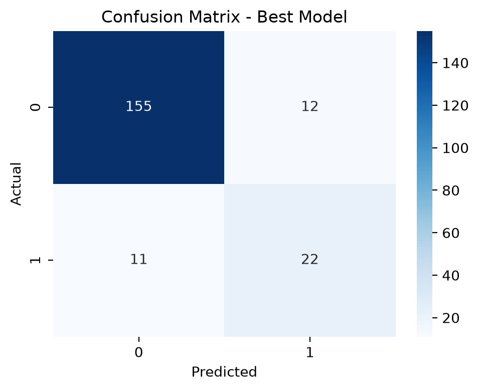
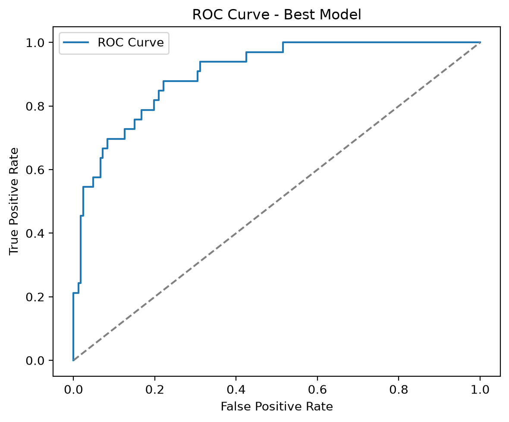
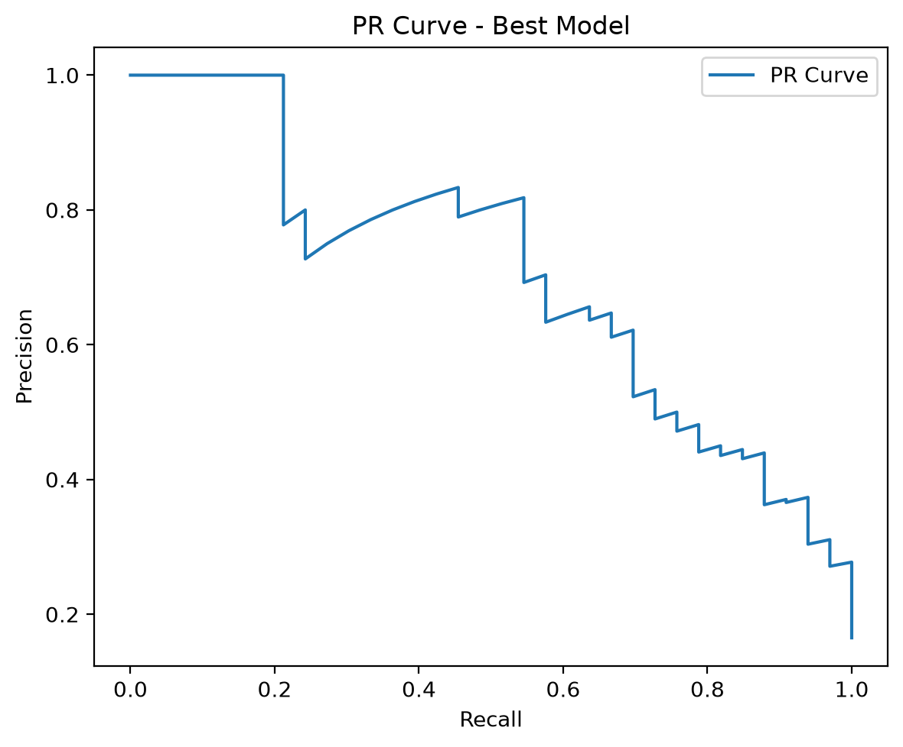
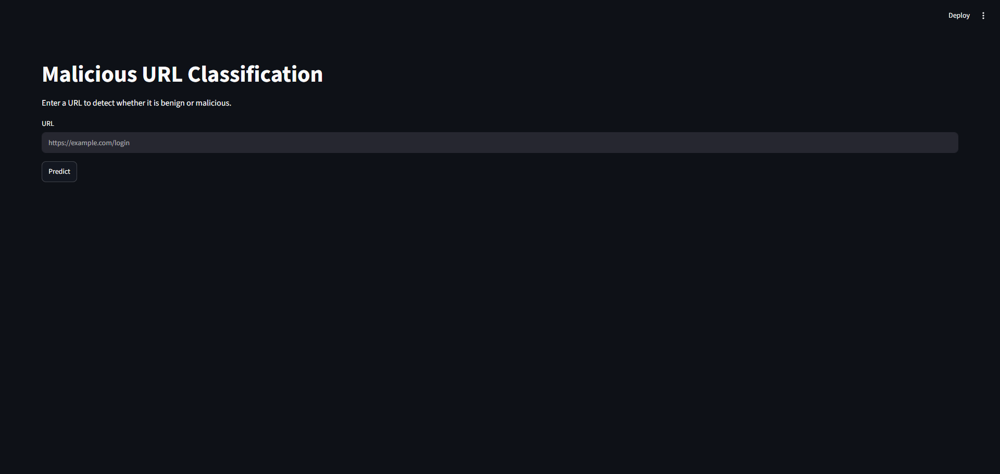
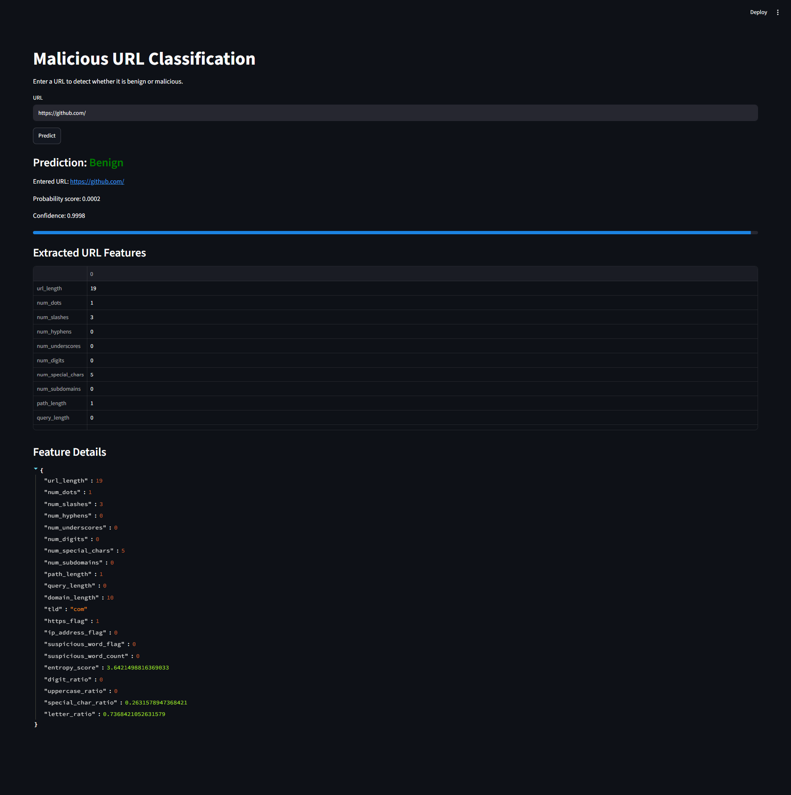
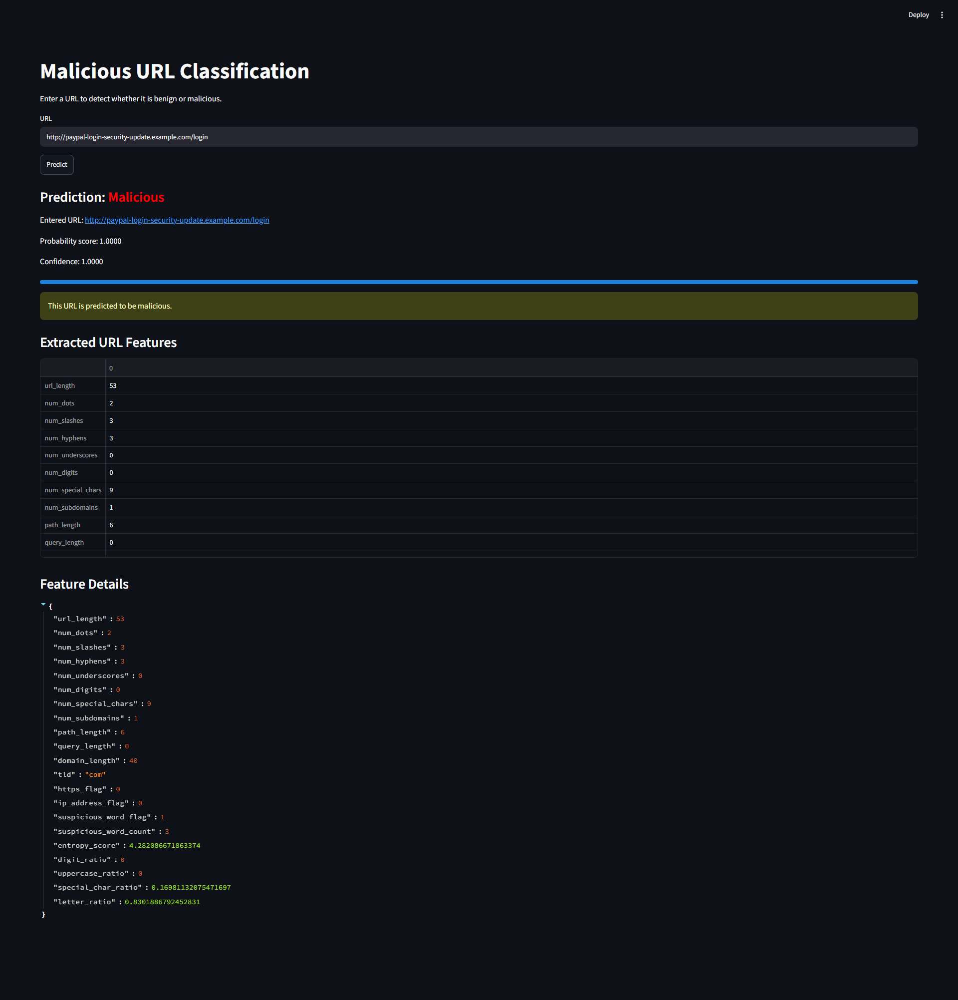

# 🛡️ Malicious URL Classification

An end-to-end **Machine Learning** project that detects whether a URL is **Benign (0)** or **Malicious (1)**. The project covers the complete machine learning lifecycle, including data preprocessing, feature engineering, model training, hyperparameter tuning, evaluation, model persistence, and deployment through an interactive **Streamlit** web application.

---

## 📌 Project Overview

Cybersecurity threats often originate from malicious URLs used in phishing, malware distribution, spam campaigns, and credential theft. This project applies Natural Language Processing (NLP) and Machine Learning techniques to automatically classify URLs before users visit them.

The pipeline automatically:

* Detects the URL and label columns
* Cleans and preprocesses the dataset
* Normalizes labels into binary classes
* Extracts handcrafted URL features
* Builds CountVectorizer and TF-IDF representations
* Handles class imbalance using SMOTE (when required)
* Trains and compares multiple machine learning models
* Performs hyperparameter tuning
* Evaluates model performance
* Saves the best trained model
* Deploys the classifier using Streamlit

---

# ✨ Features

* ✅ Automatic dataset schema detection
* ✅ Dataset profiling and preprocessing
* ✅ URL feature engineering
* ✅ Character and word n-gram vectorization
* ✅ CountVectorizer & TF-IDF comparison
* ✅ Class imbalance handling with SMOTE
* ✅ Multiple Machine Learning classifiers
* ✅ Cross-validation
* ✅ GridSearchCV & RandomizedSearchCV
* ✅ ROC, Precision-Recall and Confusion Matrix visualization
* ✅ Model persistence (.pkl)
* ✅ Interactive Streamlit application

---

# 📂 Project Structure

```text
Malicious-URL-Classification/
├── README.md
├── app.py
├── build_artifacts.py
├── data/
│   └── dataset.csv
├── models/
│   ├── best_model.pkl
│   ├── selected_vectorizer.pkl
│   └── tfidf_vectorizer.pkl
├── notebooks/
│   └── malicious_url_classification.ipynb
├── outputs/
│   ├── figures/
│   │   ├── confusion_best_model.png
│   │   ├── pr_best_model.png
│   │   └── roc_best_model.png
│   └── screenshots/
│       ├── home.png
│       ├── malicious_warning.png
│       └── prediction.png
├── requirements.txt
└── src/
```

---

# ⚙️ Installation

Clone the repository

```bash
git clone https://github.com/YourUsername/Malicious_URL_Classification.git
cd Malicious_URL_Classification
```

Create a virtual environment

```bash
python -m venv venv
```

Activate it

Windows

```bash
venv\Scripts\activate
```

Linux / macOS

```bash
source venv/bin/activate
```

Install dependencies

```bash
pip install -r requirements.txt
```

---

# 📊 Dataset

Place the dataset in the following directory before running the project:

```text
data/
└── dataset.csv
```

The preprocessing pipeline automatically detects the **URL** and **label** columns, cleans the data, extracts features, and prepares the dataset for machine learning.

---

## 📈 Dataset Statistics

| Metric | Value |
|:-------|------:|
| **Total URLs** | **411,177** |
| **Benign URLs** | **344,799 (83.86%)** |
| **Malicious URLs** | **66,378 (16.14%)** |
| **Classes** | 2 (Benign / Malicious) |

---

## 📝 Dataset Description

The dataset contains **411,177** URLs collected for binary classification of web addresses into **Benign** and **Malicious** categories.

As shown in the statistics above, the dataset is **highly imbalanced**, with benign URLs representing approximately **84%** of all samples and malicious URLs accounting for only **16%**. Such imbalance can bias machine learning models toward predicting the majority class.

To address this issue, the project applies **SMOTE (Synthetic Minority Over-sampling Technique)** exclusively to the **training dataset**. SMOTE generates synthetic malicious samples to balance the class distribution, helping the models learn more representative decision boundaries and improving their ability to detect malicious URLs while reducing bias toward benign predictions.

> **Note:** SMOTE is applied **only to the training set**. The validation and test sets remain unchanged to ensure a fair and realistic evaluation of model performance.

---

## 📊 Class Distribution

| Class | Samples | Percentage |
|:------|---------:|-----------:|
| 🟢 Benign | 344,799 | 83.86% |
| 🔴 Malicious | 66,378 | 16.14% |
| **Total** | **411,177** | **100%** |

---

## 🎯 Why SMOTE?

Without balancing the dataset, machine learning models may achieve high overall accuracy while performing poorly at detecting malicious URLs.

Applying **SMOTE** provides several advantages:

- Improves minority (malicious) class recognition.
- Reduces prediction bias toward benign URLs.
- Increases Recall and F1-Score for malicious URL detection.
- Produces a more balanced training dataset, leading to better generalization.

This preprocessing step contributes to a more robust and reliable malicious URL classification system.
---

# 🚀 Training

Run

```bash
python -m src.train
```

The training pipeline automatically performs

* Dataset analysis
* Data cleaning
* Feature engineering
* Text vectorization
* Model comparison
* Hyperparameter tuning
* Performance evaluation
* Artifact generation

All generated files are saved inside the **outputs/** and **models/** folders.

---

# 🌐 Streamlit Web Application

Launch the application

```bash
streamlit run app.py
```

The application allows users to

* Enter any URL
* Predict whether it is Benign or Malicious
* Display prediction confidence
* Inspect extracted URL features

---

# 📈 Model Performance

## Confusion Matrix

The confusion matrix illustrates how accurately the best-performing classifier distinguishes between benign and malicious URLs.

<p align="center">

</p>

---

## ROC Curve

The ROC Curve demonstrates the classifier's ability to separate malicious URLs from legitimate ones across different decision thresholds.

<p align="center">

</p>

---

## Precision-Recall Curve

The Precision-Recall Curve highlights the model's effectiveness on the malicious class, which is especially important for cybersecurity applications involving imbalanced datasets.

<p align="center">

</p>

---

# 💻 Streamlit Application

## Home Interface

The application's homepage allows users to enter any URL for analysis.

<p align="center">

</p>

---

## URL Prediction

Example of a successful prediction displaying the predicted class along with the confidence score.

<p align="center">

</p>

---

## Malicious URL Detection

Example showing the warning displayed when the model identifies a malicious URL.

<p align="center">

</p>

---

# 📁 Generated Outputs

```
outputs/
├── figures/
├── metrics/
├── reports/
└── screenshots/
```

The project automatically generates:

* Model comparison tables
* Vectorizer comparison tables
* ROC Curve
* Precision-Recall Curve
* Confusion Matrix
* Classification reports
* Best model summary
* Streamlit screenshots

---

# 📦 Saved Models

```
models/
├── best_model.pkl
├── selected_vectorizer.pkl
└── tfidf_vectorizer.pkl
```

These artifacts are used directly by the Streamlit application for inference.

